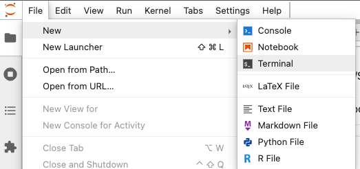
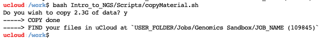

# Genomics sandbox

In this app you will find material for the genomics sandbox of the **[Health Data Science sandbox](https://hds-sandbox.github.io)**. This contains courses you can learn from, datasets and tools you can work with for your own research/learning purposes. Each item of this sandbox is based on jupyterlab. Jupyterlab is a web-based integrated development environment for Jupyter notebooks, code, and data. Usually, each item includes a dedicated webpage with additional informations, guides, and material.

## Available items

Items are periodically added to this app and can be chosen from the menu. Each item can be for example a course, a setup to work with specific softwares, a research example and comes with all necessary packages installed, eventual notebooks with computer code and explanations, and a dedicated webpage with additional material (notes, slides, recordings, ...).

### Courses

 The available courses are

| Course name      | Description |  Links    | Programming language |
| :-----------: | ----------- | ----------- | ----------- |
| **Introduction to NGS data analysis**  | 
 A one-week course to introduce NGS data, from data alignment to bioinformatics analysis 
 | [Webpage](https://hds-sandbox.github.io/NGS_summer_course_Aarhus/) | Python, R, bash |
| **Introduction to Population genomics**  | 
 A course introducing and applying bioinformatic tools to perform a whole population genomics analysis 
 | [Webpage](https://hds-sandbox.github.io/NGS_summer_course_Aarhus/) | bash, R, python |

### Tools

 The available tools are

| Tool name      | Description |  Links    | Programming language |
| :-----------: | ----------- | ----------- | ----------- |
| **IGV - Integrative Genomics viewer**  | 
 A High-performance, easy-to-use, interactive tool for the visual exploration of genomic data. It supports flexible integration of all the common types of genomic data and metadata, investigator-generated or publicly available. 
 | [Official Manual](https://igvteam.github.io/igv-webapp/) | Interactive User Interface |

## Copying folders from a course session

If you want to get some of the material you have been working on using the app, you have two possibilities.

### Download only your code

You can always download specific jupyter notebooks from jupyterlab. Simply right-click on a notebook, and choose `Download`. Upload the notebooks again in a future session of the app to work on them again. Note that all your **outputs from the code are lost**, so you must rerun your notebooks.

### Download code, data and results

You can copy the whole folder containing code, results and data.
The downloaded course material can be found into the folder `Jobs/Genomics Sandbox/$JOB_ID` under your personal user files, where `$JOB_ID` is the folder related to the session. To download all the material, you have to follow these steps while you are in jupyterlab:

* Open a new terminal using `File --> New --> Terminal`
  
* Write the command `bash ./$COURSE/Scripts/copyMaterial.sh`. You will be asked to confirm if you want to copy the data. **Check if that amount of data actually fits into your storage space on `uCloud` before accepting.**
* If you execute the copy, you receive a confirmation message with the folder where you can find the data.

## Additional options

Before submitting the app, you can choose a course and the amount of resources you need. Additionally, you can add folders so that they will be visible when using jupyterlab. Adding folders is useful if

- you want to use a folder containing **your own data and code**, with which you want to perform analysis with the Genomics tools of a course/module
- you want to continue working on the material **from a  previous session** of the Genomics Sandbox. In such a case, add the folder containing the material using the option `Add folder`. 

