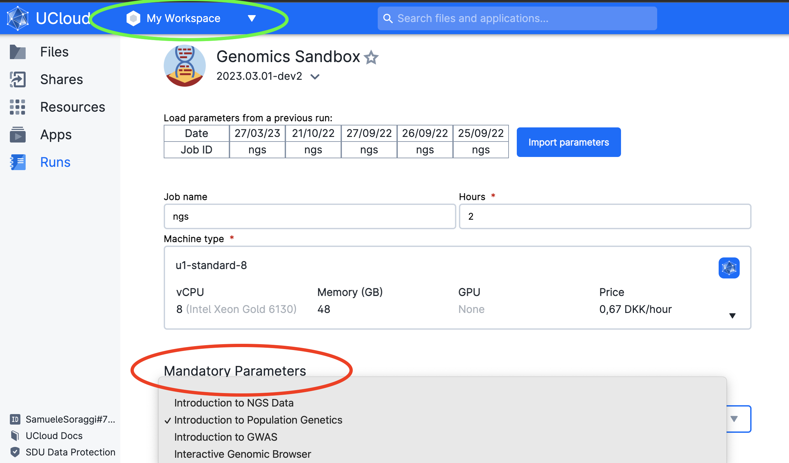
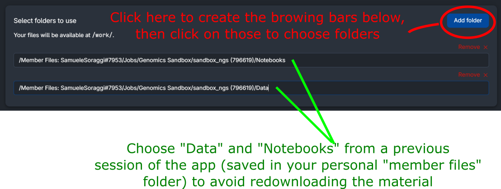
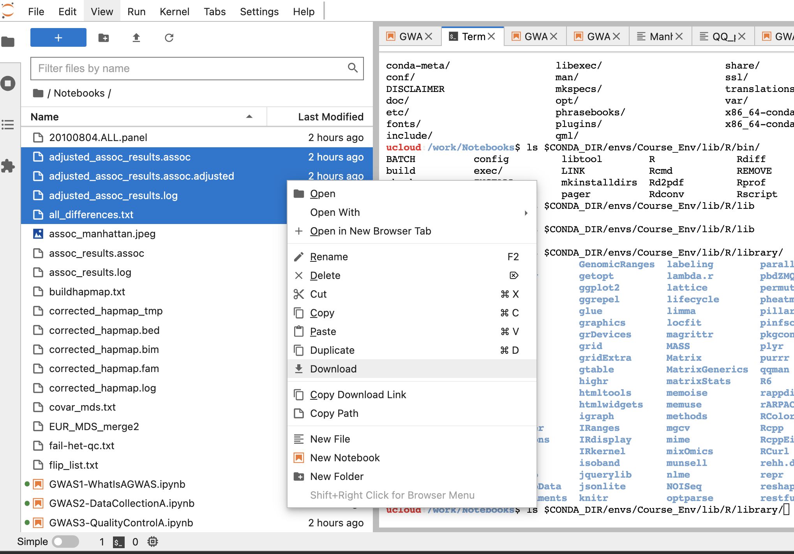

# Genomics sandbox

In this app, you will find material for the genomics sandbox of the **[Health Data Science sandbox](https://hds-sandbox.github.io)**. It contains course tutorials, datasets, and tools you can use for research or self-learning. Each course item of this sandbox is based on Jupyterlab. Jupyterlab is a web-based integrated development environment for Jupyter notebooks, code, and data.

# Table of Contents

1. [Introduciton](#introduction)  
2. [Usage on UCloud](#usage-on-ucloud)  
3. [Usage on GenomeDK](#usage-on-genomedk)  
4. [Independent Users](#independent-usage)

# Introduction

## Available material

Items are periodically added to this app and can be chosen from the menu. Each item can be a course, a setup to work with specific software, or a research workflow example. They come with all necessary packages installed, notebooks with computer code and explanations, and a dedicated webpage with additional material (notes, slides, recordings, ...).

### Courses

 The available courses are

| Course name      | Description |  Links    | Programming language |
| :-----------: | ----------- | ----------- | ----------- |
| **Introduction to NGS data analysis**  | <div style="text-align: justify"> A one-week course to introduce NGS data, from data alignment to bioinformatics analysis </div> | [Webpage](https://hds-sandbox.github.io/NGS_summer_course_Aarhus/) | Python, R, bash |
| **Introduction to Population genomics**  | <div style="text-align: justify"> A course introducing and applying bioinformatic tools to perform a whole population genomics analysis </div> | [Webpage](https://hds-sandbox.github.io/PopulationGenomicsCourse/) | bash, R, python |
| **Introduction to GWAS**  | <div style="text-align: justify"> An introductory course in Genome-Wide Association Studies </div> | [Webpage](https://hds-sandbox.github.io/GWAS_course/) | bash, R |

### Tools

 The available tools are

| Tool name      | Description |  Links    | Programming language |
| :-----------: | ----------- | ----------- | ----------- |
| **IGV - Integrative Genomics viewer**  | <div style="text-align: justify"> A High-performance, easy-to-use, interactive tool for the visual exploration of genomic data. It supports flexible integration of all the common types of genomic data and metadata, investigator-generated or publicly available. </div> | [Official Manual](https://igvteam.github.io/igv-webapp/) | Interactive User Interface |

## Download the course data and notebooks

Each course is open-source, and the data is freely available. Here is the link to all repositories, where you can download the datasets and the notebooks.

| Course name      | Data Repository | Notebooks repo | 
| :-----------: | ----------- | ----------------| 
| **Introduction to NGS data analysis**  | [Link](https://zenodo.org/record/7670370) | [Repo](https://github.com/hds-sandbox/NGS_summer_course_Aarhus) |
| **Introduction to Population genomics**  | [Link](https://zenodo.org/record/7670839) |[Repo](https://github.com/hds-sandbox/PopulationGenomicsCourse) |
| **Introduction to GWAS**  | [Link](https://github.com/hds-sandbox/GWAS_course) | [Repo](https://github.com/hds-sandbox/GWAS_course)|

# Usage on UCloud 
## Choosing an item on UCloud

To choose an item, open the App `Genomics Sandbox` on UCloud. You can decide on the settings and a course or tool from the drop-down menu (red circle in the figure below). Remember to select the project where you have storage space: `My Workspace` is your workspace with ~50GB of storage (green circle in the figure below), but you might have obtained a project with more storage and compute credit, or you might have been invited into a project (for example, in one of our course).



Finally, you can start the app by clicking on `Submit`. The App needs to download data and packages which can take some time. See below **how to reuse the data and avoid long waiting time** (you need however to download data the first time you run the app).

### Available options

Additionally, you can use data and notebooks running in a previous session of the App. **The app will otherwise download the data and the notebooks a new one every time**.

To choose the data from previous sessions, click on `Add folders` on the browsing bar appearing in the gray option box (red circle in the figure below). Then, find your latest session of the sandbox (inside the folder `Jobs/Genomics Sandbox` under your personal user folder as shown below) and choose the folder you need. In this example, accepted folders are `Data` and `Notebooks`.



## Download the data you generated

You can easily download files you generated by right-clicking on selected files in the browser of Jupyterlab, and by choosing download (see figure below).



# Usage on GenomeDK

We recommend using [GenomeDK Desktop](https://desktop.genome.au.dk/) - a browser-based virtual desktop solution. Follow these steps to get the app running:

1. Log in to GenomeDK Desktop.
2. Open a terminal and navigate to or create a new folder, then pull the Docker image of the app.
 ```{.bash}
 # docker
 docker pull hdssandbox/genomicsapp
 # singularity
 singularity pull genomicsapp.sif docker://hdssandbox/genomicsapp 
 ```
3. Copy the command below and modify it accordingly.
   ```{.bash}
   srun --mem=32g --cores=2 --time=0:10:0 --account=<YOURPROJECT> --pty singularity exec --writable-tmpfs --fakeroot --bind /tmp:/tmp --bind $(pwd):$(pwd) --pwd $(pwd) --bind /etc/ssl/certs:/etc/ssl/certs --bind /etc/pki/ca-trust:/etc/pki/ca-trust /path/to/genomicsapp.sif start-app -c "Intro_to_GWAS -p $UID"
   ```
4. The command above is used to run the image as an interactive session on the HPC, specifying the time, cores, and memory allocation.
     - Adjust the settings to your needs. Check [GenomeDK guidelines](https://genome.au.dk/docs/interacting-with-the-queue/) if in doubt. 
     - Choose the directories that should be bound for inclusion inside the container.
5. Click on "Show clipboard" at the top-right of the Desktop, and paste the modified command there.
5. In the terminal, paste the command and ensure you are in the desired working directory (e.g., `intro_to_GWAS` in one of your projects as we are binding the `pwd`).
6. Open the link displayed in the terminal, which includes the node name and port number (e.g., cn-1040:8787 or s21n31:8787).

# Independent Users

The app is a **Docker image** that you can use on a different machine or your own computer. To use it, you should be familiar with Docker/Singularity. Simply pull the image and run the container using the command `start-app -c "Intro-to-GWAS"` (example below).

Link: https://hub.docker.com/r/hdssandbox/genomicsapp. 

#### Pull docker image 
```{.bash}
# docker
docker pull hdssandbox/genomicsapp
# singularity
singularity pull genomicsapp.sif docker://hdssandbox/genomicsapp 
```

#### Run the container 
```{.bash}
singularity run genomicsapp.sif start-app -c "Intro_to_GWAS"
```

