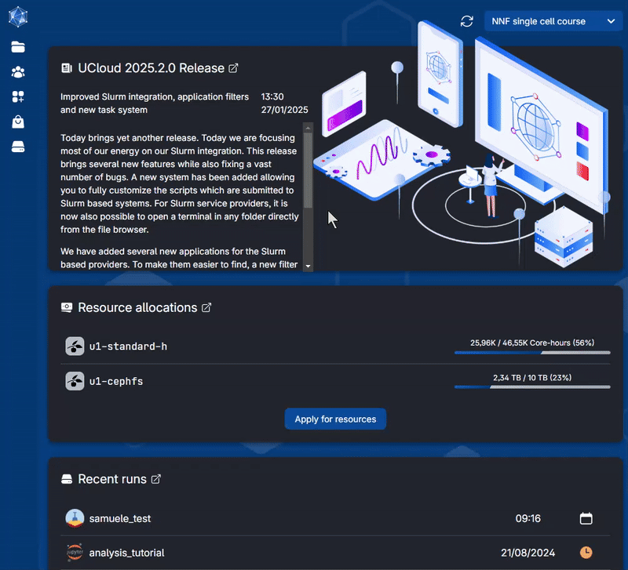

# Genomics sandbox

In this app, you will find material for the genomics sandbox of the **[Health Data Science sandbox](https://hds-sandbox.github.io)**. It contains course tutorials, datasets, and tools you can use for research or self-learning. Each course item of this sandbox is based on Jupyterlab. Jupyterlab is a web-based integrated development environment for Jupyter notebooks, code, and data.

## Available material

Items are periodically added to this app and can be chosen from the menu. Each item can be a course, a setup to work with specific software, or a research workflow example. They come with all necessary packages installed, notebooks with computer code and explanations, and a dedicated webpage with additional material (notes, slides, recordings, ...).

### Courses

 The available courses are

| Course name      | Description |  Links    | Programming language |
| :-----------: | ----------- | ----------- | ----------- |
| **Introduction to NGS data analysis**  | 
 A one-week course to introduce NGS data, from data alignment to bioinformatics analysis 
 | [Webpage](https://hds-sandbox.github.io/Intro-NGS-AU_course/) | Python, R, bash |
| **Introduction to Population genomics**  | 
 A course introducing and applying bioinformatic tools to perform a whole population genomics analysis 
 | [Webpage](https://hds-sandbox.github.io/PopulationGenomicsCourse/) | bash, R, python |
| **Introduction to GWAS**  | 
 An introductory course in Genome-Wide Association Studies 
 | [Webpage](https://hds-sandbox.github.io/GWAS_course/) | bash, R |

## Download the course data and notebooks

Each course is open-source, and the data is freely available. Here is the link to all repositories, where you can download the datasets and the notebooks.

| Course name      | Data Repository | Notebooks repo | 
| :-----------: | ----------- | ----------------| 
| **Introduction to NGS data analysis**  | [Link](https://zenodo.org/record/7670370) | [Repo](https://github.com/hds-sandbox/Intro-NGS-AU_course) |
| **Introduction to Population genomics**  | [Link](https://zenodo.org/record/7670839) |[Repo](https://github.com/hds-sandbox/PopulationGenomicsCourse) |
| **Introduction to GWAS**  | [Link](https://github.com/hds-sandbox/GWAS_course) | [Repo](https://github.com/hds-sandbox/GWAS_course)|

# Usage on UCloud 
## Choosing an item on UCloud

To choose an item, open the App `Genomics Sandbox` on UCloud. You can find it under the Application menu of the toolbar on the left. Choose `Courses` from the list, thenm select `Health data science sandbox`, `Transcriptomics Sandbox`. 

You can decide on the settings and a module from the drop-down menu (red circle in the figure below). Remember to select the project where you have storage space: `My Workspace` is your workspace with ~100GB of free storage (green circle in the figure below) and some free computing credit, but you might have obtained a project with more storage and compute credit, or you might have been invited into a project (for example, in one of our courses, or you requested a project yourself).

Finally, you can start the app by clicking on `Submit`. The App needs to download data and packages which can take some time. See below **how to reuse the data and avoid download time** (you need however to download data the first time you run the app).

### Available options

Additionally, you can use data and notebooks running in a previous session of the App. **The app will otherwise download the data and the notebooks anew every time**.

To choose the data from previous sessions, click on `Add folders` on the browsing bar appearing in the gray option box (red circle in the figure below). Then, find your latest session of the sandbox (inside the folder `Jobs/Genomics Sandbox` under your personal user folder as shown below) and choose the folder you need. In this example, accepted folders are `Data` and `Notebooks`.

More detailed instructions are found in the webpage of each module.

## Download the data you generated

You can easily download files you generated by right-clicking on selected files in the browser of Jupyterlab, and by choosing download (see figure below).

